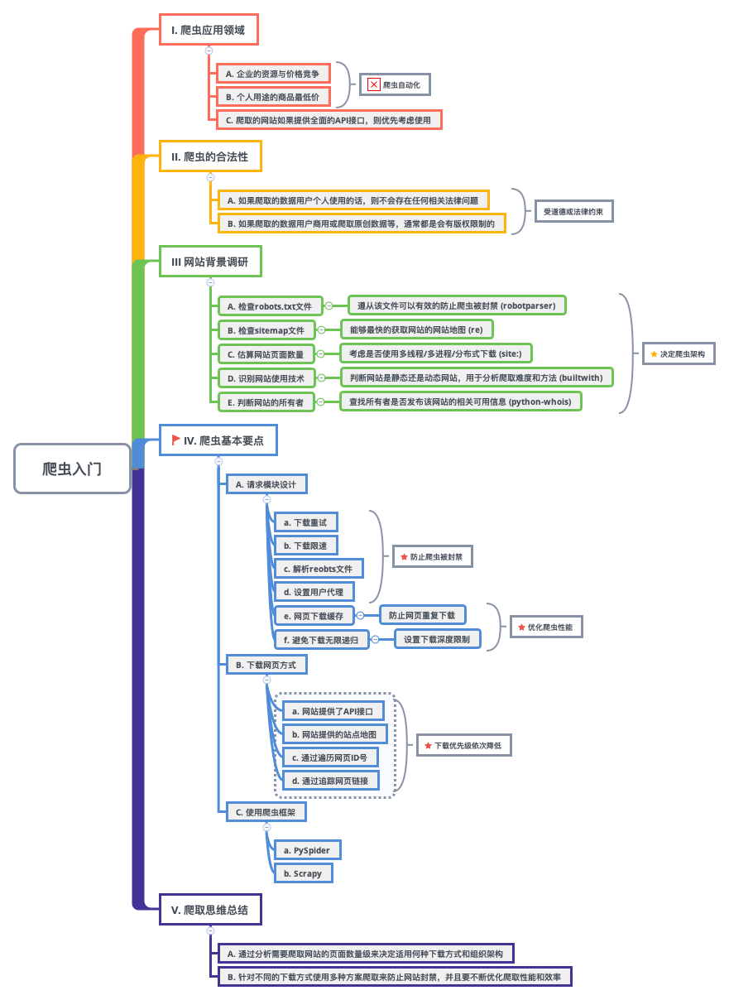

  

  <b>web-crawler-guide 🕷 使用Python写网络爬虫</b>

  
  
  

  

## 目录结构

- [1. 环境配置](https://github.com/EscapeLife/web-crawler-guide#1-%E7%8E%AF%E5%A2%83%E9%85%8D%E7%BD%AE)
- [2. 基础知识](https://github.com/EscapeLife/web-crawler-guide#2-%E5%9F%BA%E7%A1%80%E7%9F%A5%E8%AF%86)
- [3. 爬虫入门](https://github.com/EscapeLife/web-crawler-guide#3-%E7%88%AC%E8%99%AB%E5%85%A5%E9%97%A8)

## 1. 环境配置

- **[1] 思维脑图**

【图】

- **[2] 核心要点**
  - xxx

- **[3] 代码说明**
  - xxx

- **[4] 注意事项**
  - xxx

## 2. 基础知识

- **[1] 思维脑图**

[图]

- **[2] 核心要点**
  - xxx

- **[3] 代码说明**
  - xxx

- **[4] 注意事项**
  - xxx

## 3. 爬虫入门

- **[1] 思维脑图**

- **[2] 核心要点**

- **[3] 代码说明**
  - xxx

- **[4] 注意事项**
  - xxx

## 联系方式

    

- **💭 [Name] 💭**
  - 🐠 **[`EscapeLife`](https://escapelife.github.io)** 😏
- **💭 [Induction] 💭**
  - 🏦 **[`Focusing P.A.I`](https://paodingai.com/)** 😂
- **💭 [Email] 💭**
  - 📫 **[`wenpanhappy@gmail.com`](https://escapelife.github.io)** 🤔
- **💭 [Myblog] 💭**
  - 🍺 **[`https://escapelife.github.io`](https://escapelife.github.io)** 😚
- **💭 [License] 💭**
  - 🚧 [**`Apache License, Version 2.0`**](http://www.apache.org/licenses/LICENSE-2.0.html)😝
