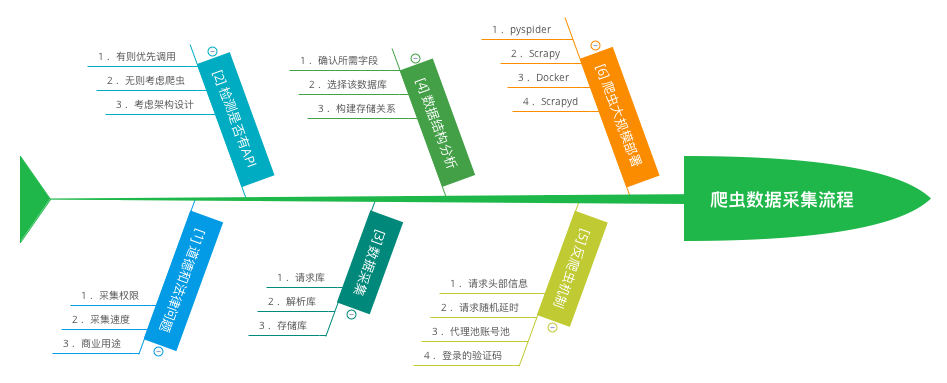
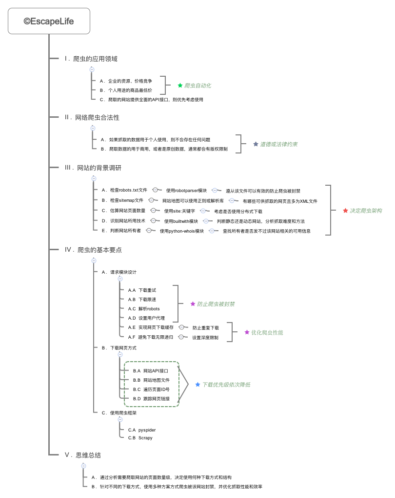
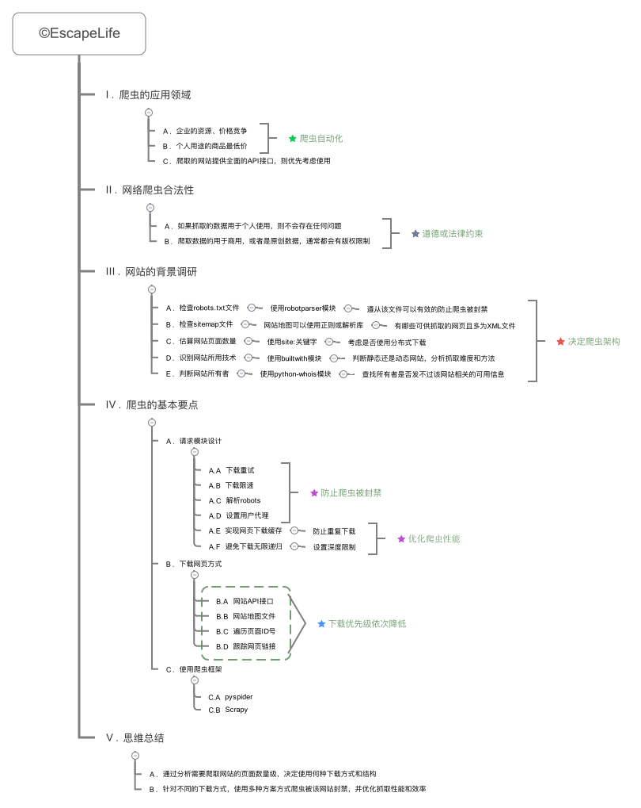

# 网络爬虫指北攻略

> 注意: 本指北攻略的所有代码，均运行在最新的`Python3.7`版本之上。

------------------

## 目录结构

- [1. 环境配置]()
- [2. 基础知识]()
- [3. 爬虫入门](https://github.com/EscapeLife/web-crawler-guide#3-%E7%88%AC%E8%99%AB%E5%85%A5%E9%97%A8)

------------------

## 1. 环境配置

> 工欲善其事，必先利其器。

- **[1] 思维脑图**

【图】

- **[2] 核心要点**
  - xxx

- **[3] 代码说明**
  - xxx

- **[4] 注意事项**
  - xxx

## 2. 基础知识

> 想要用好网络爬虫，必须要有一个良好的基础作为支持。

- **[1] 思维脑图**

- **[2] 核心要点**
  - xxx

- **[3] 代码说明**
  - xxx

- **[4] 注意事项**
  - xxx

## 3. 爬虫入门

> 理想情况下，使用网站提供`API`接口，不行则考虑爬虫。

- **[1] 思维脑图**

- **[2] 核心要点**
  - xxx

- **[3] 代码说明**
  - xxx

- **[4] 注意事项**
  - xxx
